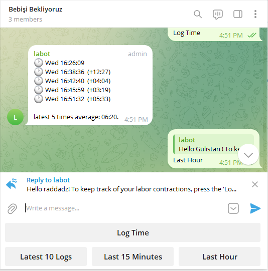
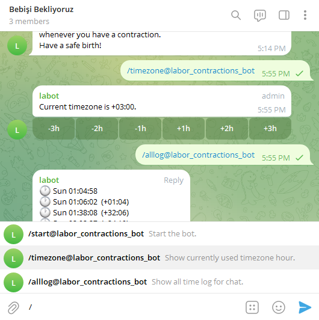

# Labor Contraction Tracker Bot

## Overview

This project is a **proof of concept (PoC)** Telegram bot designed to help track labor contractions during childbirth. It was developed in a short span of 2-3 hours. While the bot is functional, it still requires more organization and is missing some features.

## Features

- **Log Contractions**: Users can log contractions by pressing the "Log Time" button. The bot displays the last few contractions, including the time elapsed between each contraction.
- **Timezone Adjustment**: Users can adjust their timezone to ensure accurate logging.
- **Customizable Views**: The bot offers various views, including the last 10 logs, the last 15 minutes, and the last hour.

## Setup

### Environment Variables

- **LABOT_TOKEN**: Set this environment variable to your Telegram bot token.

### Running the Bot

1. **Build the Project**: Use `go build` to compile the project.
2. **Run the Bot**: Execute the compiled binary. The bot will start and begin listening for commands.

### Using Docker

You can also run this project using Docker with the provided Dockerfile:

To build and run the Docker container:
1. **Build the Docker Image**: docker build -t labot .
2. **Run the Docker Container**: docker run -e LABOT_TOKEN=<your_token> labot

## Commands

- **/start**: Start the bot and initialize the chat.
- **/timezone**: Show the currently used timezone hour.
- **/alllog**: Show all time logs for the chat.

## Buttons

- **Log Time**: Log a contraction.
- **Latest 10 Logs**: View the last 10 contractions.
- **Last 15 Minutes**: View contractions from the last 15 minutes.
- **Last Hour**: View contractions from the last hour.

## Timezone Buttons

- **-3h, -2h, -1h, +1h, +2h, +3h**: Adjust the timezone by the specified hours.

## Issues and To-Do Features

### Known Issues

- Timezone handling across different chats.
- Limited data persistence; logs are lost if the bot restarts.
- UserId based option could be included.

## Development

This project uses the `telebot` library for interacting with Telegram. The bot is written in Go and uses a simple in-memory storage for user data.

### Contributing

Contributions are welcome. Please submit pull requests for any changes or improvements.

### Issues

Report any issues or bugs on the GitHub issues page.
